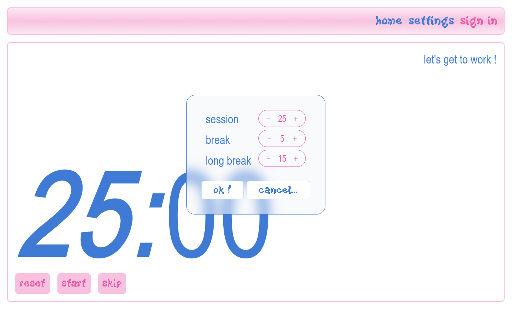
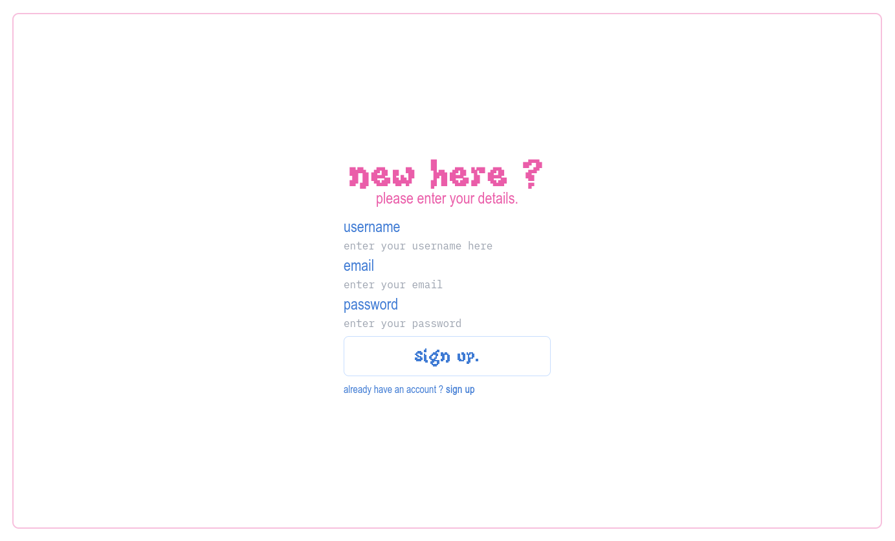
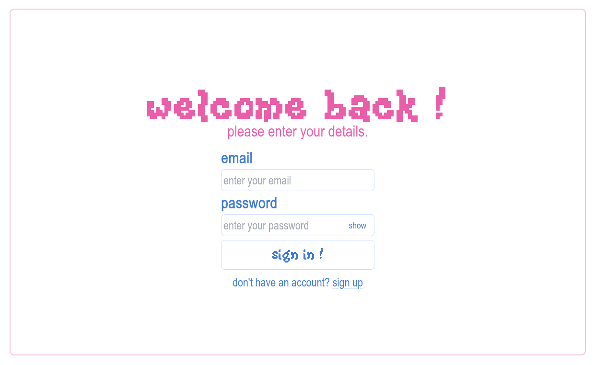

# pesca
_pesca_ is a website and brower extension inspired by the Pomodoro technique, where the user can block distracting websites while the timer is running. The website also detects when the user is looking away from their screen (to look at their phone for example). 
The user can start work sessions, log them and see their progress by creating an account.

## showcase

*the "home" page. the user can modify the pomodoro length by using the settings in the navigation bar.*

*the "sign up" page*

*the "sign in" page. after signing in, the user can have access to his profile and see logs of their past sessions (the profile page is not finished yet).*

## specs
- I wanted a simple yet cute interface for the front-end, so I used **React + Tailwind CCS** for easy styling.
- I used **NodeJs + PostgreSQL** for handling accounts, and **OpenCV** for eye tracking.
- I will use **Docker + AWS** to easily deploy this website.

## to do list
- [x] style components
- [x] add logs to user profile
- [x] add possibility to see your own password
- [ ] fix pomodoro timer cycle (in progress)
    - [ ] instantly save the settings
- [ ] update navbar when a user logs in
- [ ] add window with camera
- [ ] implement eye tracking

### extras
- [ ] add notifications when timer is over
- [ ] adding statistics user profile
- [ ] implement account confirmation
- [ ] reduce max number of entries in PomodoroLog and implement "see more" button
